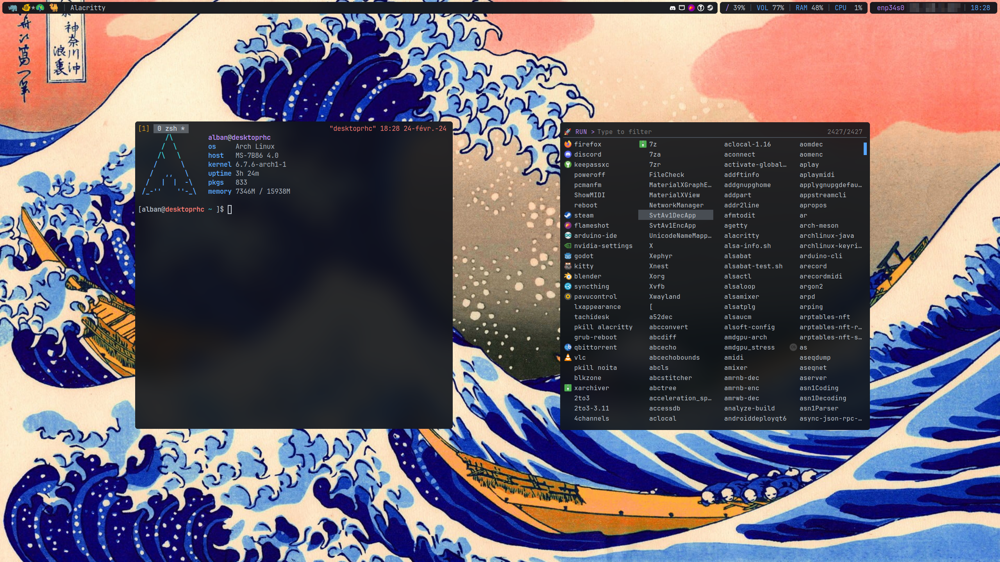

# my desktop configuration files and scripts

Based on github theme with a blur and transparency effect.

## environment

- `archlinux` as host OS
- `xorg` as display server
- `xinit` as session manager
- `i3wm` as window manager
- `polybar` as status bar
- `compfy` as compositor
- `rofi` as application launcher
- `alacritty` as terminal emulator
- `flameshot` as screenshot tool
- `tmux` as terminal multiplexer
- `zsh` as shell
- `exa` as ls replacement

## fonts

- `JetBrainsMono Nerd Font Mono` as monospace font

## usage

Clone this repository.

```sh
startx /path/to/this/repo/xinitrc
```

## screenshots




